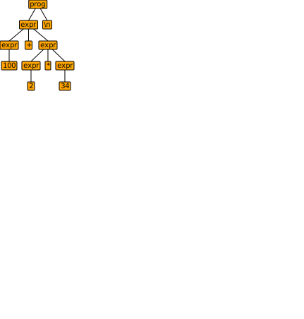

# ANTLR(ANother Tool for Language Recognition)

## 快速开始（参考 https://www.antlr.org/）

### 准备
```shell script
cd /usr/local/lib
sudo curl -O https://www.antlr.org/download/antlr-4.8-complete.jar
alias antlr4='java -jar /usr/local/lib/antlr-4.8-complete.jar'
alias grun='java -cp .:/usr/local/lib/antlr-4.8-complete.jar org.antlr.v4.gui.TestRig'
```

### 实例：计算器

1. 创建 `Expr.g4` 文件并写入以下内容：

```antlr
grammar Expr;		
prog:	(expr NEWLINE)* ;
expr:	expr ('*'|'/') expr
    |	expr ('+'|'-') expr
    |	INT
    |	'(' expr ')'
    ;
NEWLINE : [\r\n]+ ;
INT     : [0-9]+ ;
```

2. 编译

```shell script
antlr4 Expr.g4
javac -cp /usr/local/lib/antlr-4.8-complete.jar Expr*.java
```

3. 输入语句并调用 GUI

```shell script
grun Expr prog -gui
```

输入：
```shell script
100+2*34
^D
```

可以得到：

